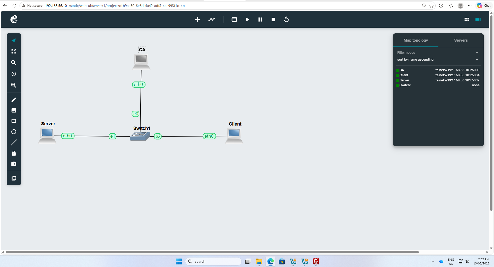
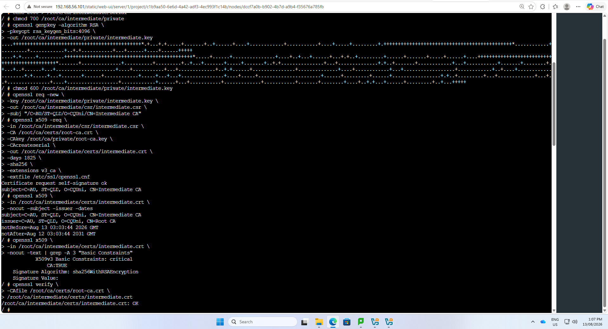
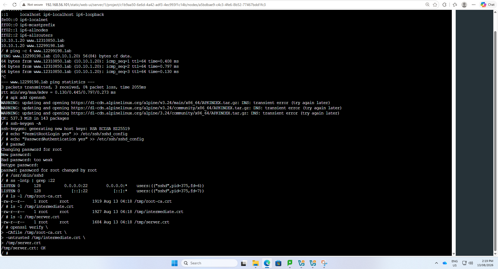
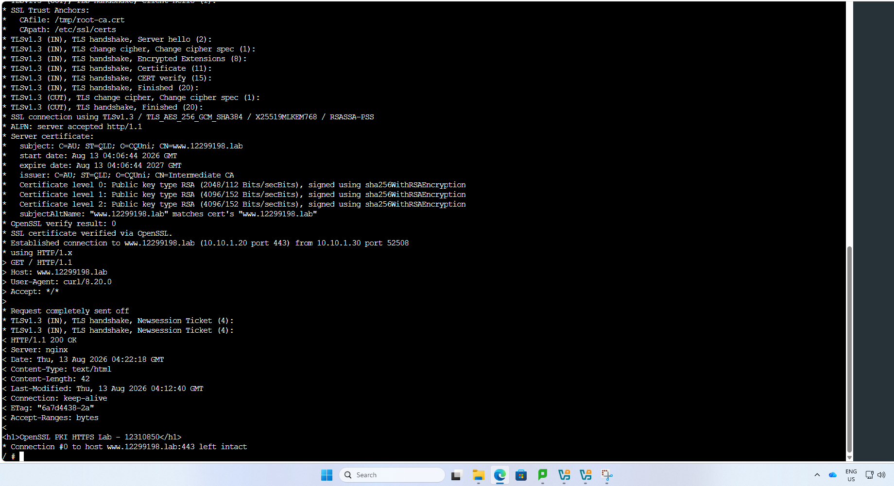
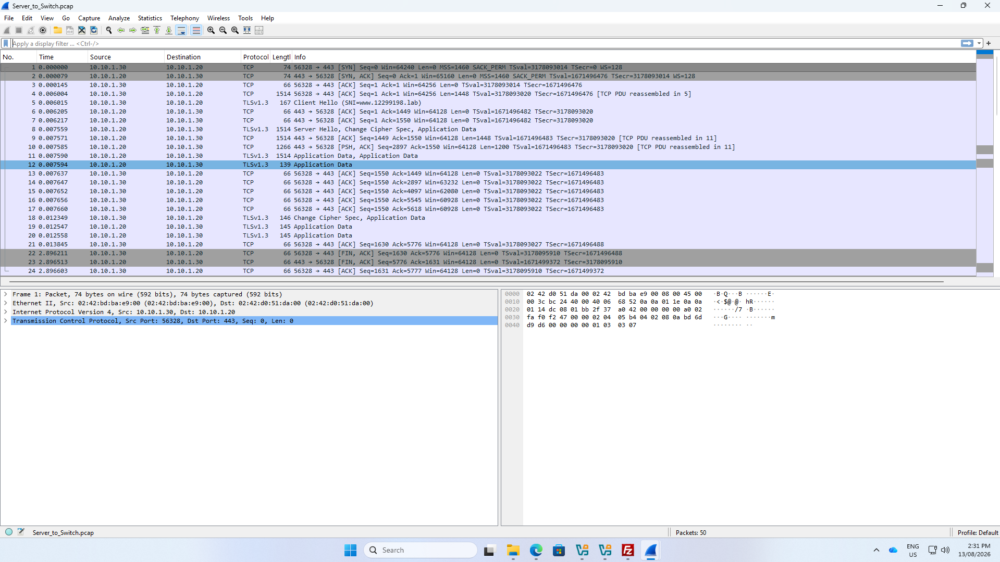

# PKI and HTTPS Hardening

This section demonstrates the implementation of a Public Key Infrastructure (PKI) and HTTPS service in GNS3.

The environment contains:

- Certificate Authority (CA)
- HTTPS Server
- Client
- Ethernet Switch

A two-tier CA structure was implemented using a Root CA and an Intermediate CA. The Intermediate CA was used to issue the server certificate. The client then verified the server certificate chain against the trusted Root CA before establishing an HTTPS connection.

## Network Topology

The GNS3 topology consists of three hosts connected through an Ethernet switch:

- CA – creates and manages the certificates
- Server – hosts the HTTPS web service
- Client – verifies the certificate chain and connects to the HTTPS server

## Two-Tier Certificate Authority

A Root CA and Intermediate CA were configured. The Intermediate CA certificate was signed by the Root CA.

The Intermediate CA certificate was checked to confirm that it was operating as a CA.

The certificate verification returned:

`/root/ca/intermediate/certs/intermediate.crt: OK`

This confirms that the Intermediate CA certificate can be successfully verified against the Root CA.

## Certificate Chain Verification

The server certificate was verified using the Root CA and Intermediate CA certificates.

The verification returned:

`/tmp/server.crt: OK`

This demonstrates that the server certificate forms a valid certificate chain through the Intermediate CA to the trusted Root CA.

## HTTPS Verification

The client connected to the HTTPS server using TLS.

The output demonstrates:

- TLS 1.3 connection
- Server certificate presented
- Intermediate CA as certificate issuer
- Subject Alternative Name matched the server hostname
- OpenSSL verification result: 0
- HTTP/1.1 200 OK response

This demonstrates that the client successfully verified the certificate and established an encrypted HTTPS connection.

## TLS Traffic Analysis

Wireshark was used to capture the connection between the client and HTTPS server.

The capture shows TLS 1.3 traffic over TCP port 443, including the Client Hello, Server Hello and encrypted Application Data.

## Security Design

A two-tier CA structure separates the Root CA from certificate-issuing operations. The Intermediate CA can be used to issue server certificates while the Root CA acts as the trust anchor.

HTTPS protects communication between the client and server using TLS. Certificate verification also allows the client to confirm the identity of the server before communicating with it.

