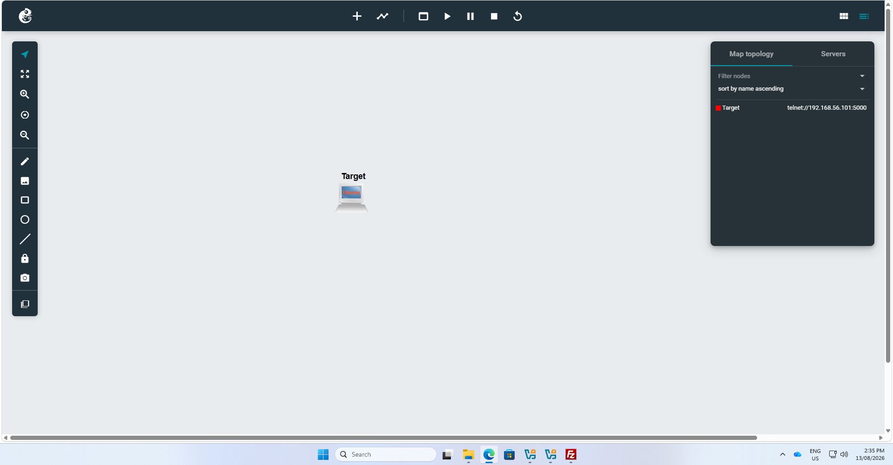
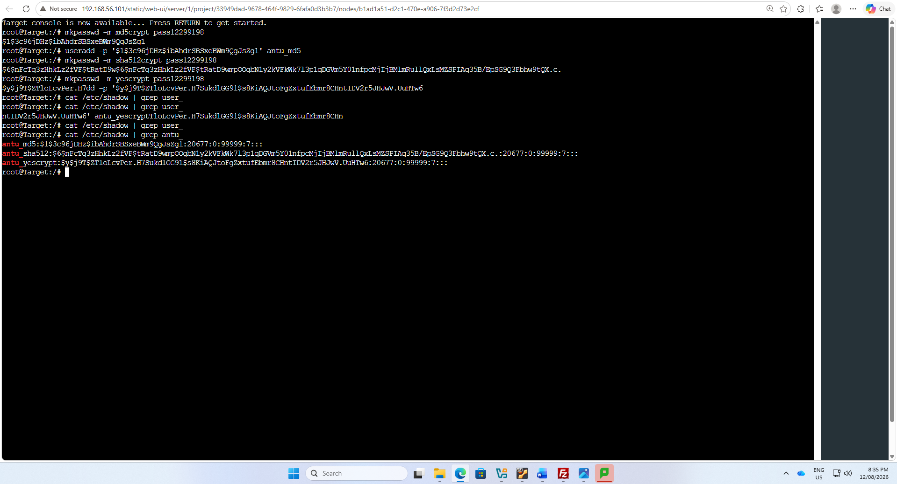
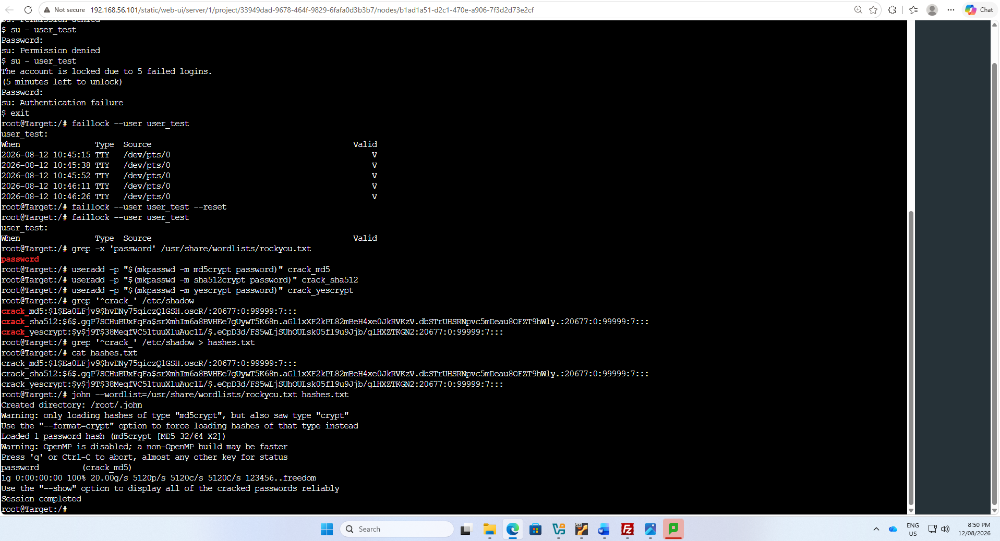

# Password Security Hardening

This section demonstrates the implementation and testing of password security controls on a Linux target system in GNS3.

The activity focused on password hashing, password-cracking resistance, and account-lockout protection. Test accounts were created using different password-hashing algorithms, and the stored password hashes were examined. A controlled password-cracking test was also performed to demonstrate the security differences between hashing methods. Finally, account lockout was tested by intentionally generating multiple failed login attempts.

The implementation included:

- Creating test user accounts.
- Comparing MD5, SHA-512 and yescrypt password hashes.
- Examining password hashes stored in `/etc/shadow`.
- Performing a controlled wordlist-based password-cracking test.
- Testing account lockout after 5 failed login attempts.
- Checking failed authentication records using `faillock`.
- Resetting the account after completing the lockout test.

---

## 1. GNS3 Password Security Environment

The password-security testing was performed on a Linux target machine running in GNS3.

The target machine was used to create test accounts, examine password hashes, perform controlled password-cracking tests, and test authentication security controls.

---

## 2. Password Hashing

Test accounts were configured with different password-hashing algorithms, including:

- MD5
- SHA-512
- yescrypt

The resulting password entries were examined in `/etc/shadow`.

Commands used during testing included:

    mkpasswd -m md5crypt pass12299198

    useradd -p "$(mkpasswd -m md5crypt pass12299198)" antu_md5

    mkpasswd -m sha512crypt pass12299198

    useradd -p "$(mkpasswd -m sha512crypt pass12299198)" antu_sha512

    mkpasswd -m yescrypt pass12299198

    useradd -p "$(mkpasswd -m yescrypt pass12299198)" antu_yescrypt

The stored password entries were inspected using:

    cat /etc/shadow | grep user
    cat /etc/shadow | grep antu

The output demonstrates that Linux stores password hashes rather than plaintext passwords and that different hashing algorithms produce different hash formats.

---

## 3. Account Lockout Protection

Account-lockout protection was tested by intentionally attempting to authenticate with an incorrect password multiple times.

After **5 failed login attempts**, the system displayed:

> The account is locked due to 5 failed logins.

The failed authentication attempts were examined using:

    faillock --user user_test

This displayed the recorded failed login attempts for the test account.

After completing the test, the lockout was reset using:

    faillock --user user_test --reset

The account was then checked again to confirm that the failed-login records had been cleared.

---

## 4. Controlled Password-Cracking Test

A controlled password-cracking test was also performed against test password hashes using a local wordlist.

The test hashes were collected into a file and tested with a password-cracking utility.

Commands shown during the activity included:

    grep '^password' /usr/share/wordlists/rockyou.txt

    useradd -p "$(mkpasswd -m md5crypt password)" crack_md5

    useradd -p "$(mkpasswd -m sha512crypt password)" crack_sha512

    useradd -p "$(mkpasswd -m yescrypt password)" crack_yescrypt

    grep '^crack_' /etc/shadow

    grep '^crack_' /etc/shadow > hashes.txt

    cat hashes.txt

The controlled wordlist test demonstrated that a weak password using the older MD5-based password-hashing scheme could be recovered quickly when the password was present in the wordlist.

This test was performed only against locally created test accounts as part of the security laboratory.

---

## 5. Security Analysis

The testing demonstrates that password security should not rely on passwords alone.

**Modern password hashing:**  
Modern password-hashing algorithms provide stronger protection for stored credentials than older schemes such as MD5.

**Strong passwords:**  
Even a password hash can be vulnerable when the original password is weak and appears in commonly available password lists.

**Account lockout:**  
Locking an account after repeated authentication failures helps reduce repeated password-guessing attempts.

Together, password hashing, strong password policies and account-lockout controls provide multiple layers of protection for user authentication.

---
