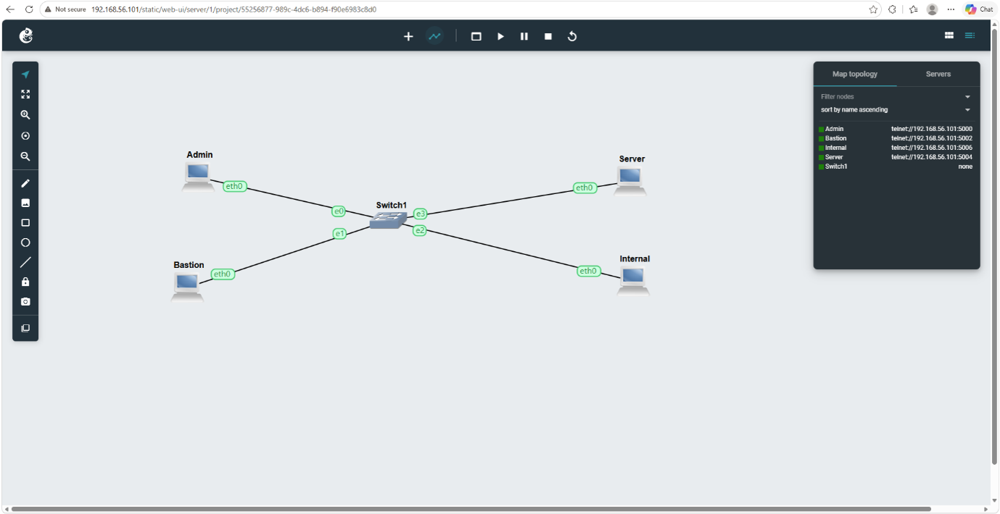
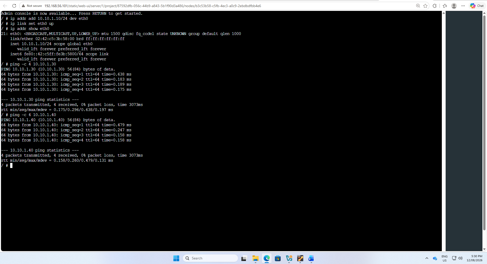
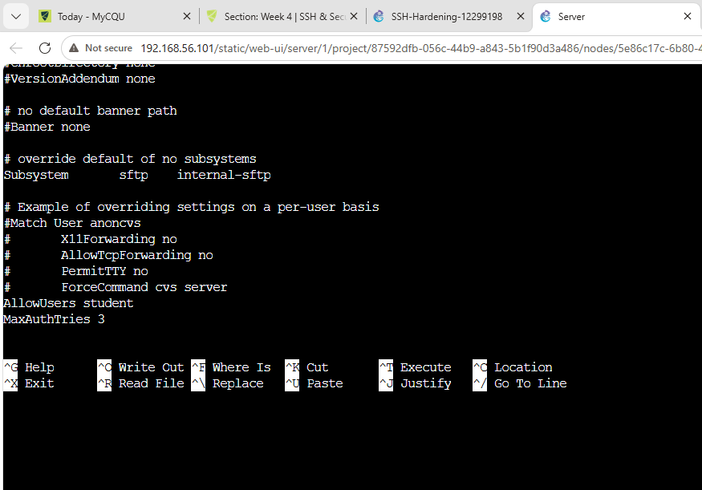
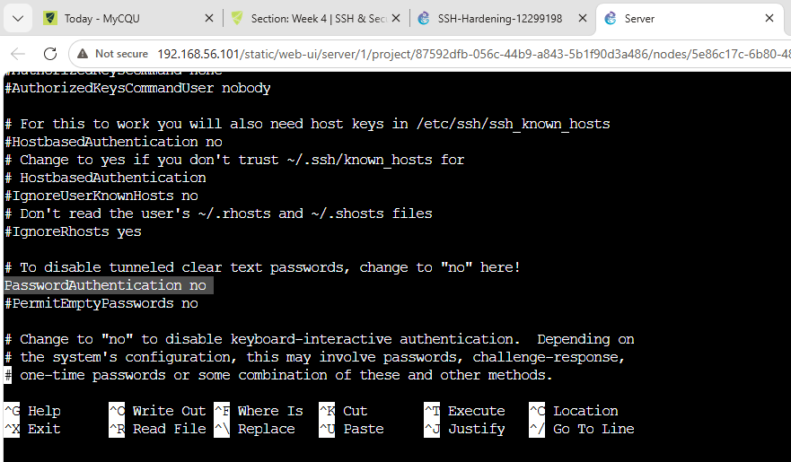
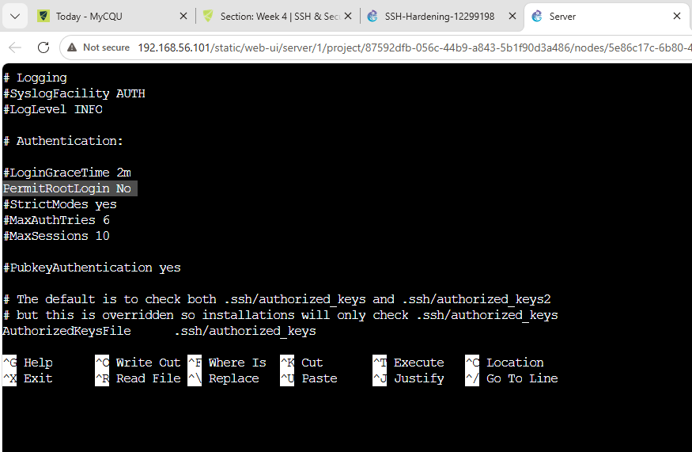
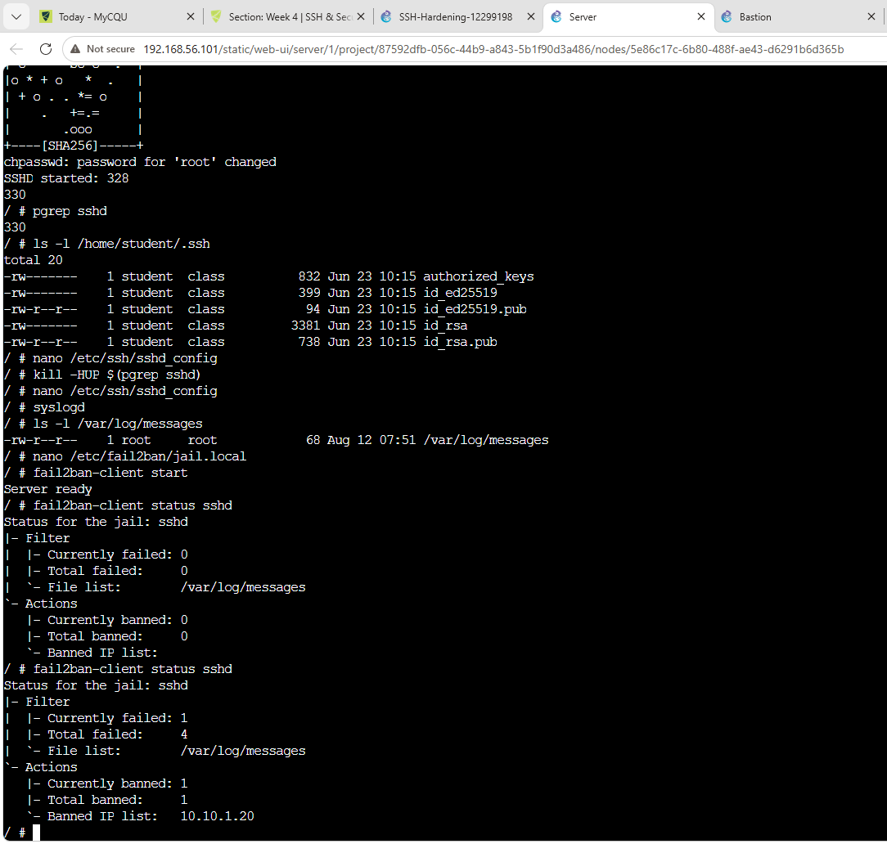
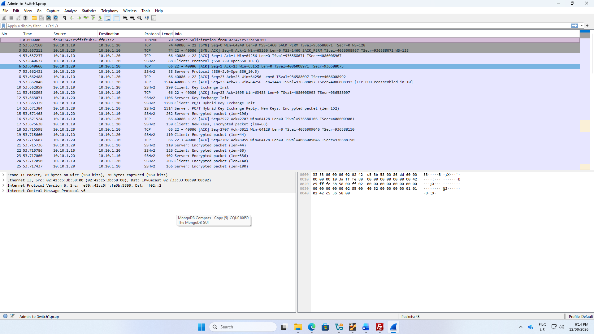

# SSH Hardening

This section demonstrates the implementation and testing of SSH security hardening in a GNS3 network environment.

The objective was to reduce the attack surface of the SSH service by restricting access, disabling insecure authentication options, using SSH keys, limiting authentication attempts, and implementing Fail2Ban protection against repeated failed login attempts.

The implementation included:

- Configuring a multi-host GNS3 SSH testing environment.
- Testing network connectivity between hosts.
- Using Ed25519 SSH keys.
- Restricting SSH access to an authorised user.
- Disabling SSH password authentication.
- Disabling direct root SSH login.
- Limiting SSH authentication attempts.
- Configuring Fail2Ban for the SSH service.
- Demonstrating that Fail2Ban blocks a source after repeated authentication failures.
- Capturing SSHv2 encrypted traffic using Wireshark.

---

## 1. GNS3 SSH Hardening Environment

The SSH security environment contains four hosts connected through an Ethernet switch:

- **Admin** – administrative SSH client.
- **Bastion** – hardened access/bastion host.
- **Server** – protected SSH server.
- **Internal** – internal network host.
- **Switch1** – provides connectivity between the hosts.

This topology provides an isolated environment for configuring and testing SSH security controls.

---

## 2. Network Connectivity

Network connectivity was configured and tested before applying the SSH security controls.

For example, the Admin host was configured with an address on the `10.10.1.0/24` network.

Commands used included:

    ip addr add 10.10.1.10/24 dev eth0
    ip link set eth0 up
    ip addr show eth0

Connectivity was tested using ICMP:

    ping -c 4 10.10.1.30
    ping -c 4 10.10.1.40

The successful responses with **0% packet loss** demonstrate that the hosts could communicate before SSH testing was performed.

---

## 3. SSH Access Restriction

The SSH server configuration was modified to restrict which user was permitted to connect.

The following setting was configured in `/etc/ssh/sshd_config`:

    AllowUsers student

The maximum number of authentication attempts was also restricted:

    MaxAuthTries 3

`AllowUsers student` limits SSH access to the authorised `student` account.

`MaxAuthTries 3` limits the number of authentication attempts permitted for an SSH connection, reducing opportunities for repeated password or credential guessing.

---

## 4. Password Authentication Disabled

Password-based SSH authentication was disabled using:

    PasswordAuthentication no

Disabling password authentication reduces exposure to password-guessing and brute-force attacks.

SSH key-based authentication can instead be used to authenticate authorised users.

---

## 5. Root Login Disabled

Direct SSH login to the root account was disabled.

The SSH configuration contains:

    PermitRootLogin No

Public-key authentication was enabled:

    PubkeyAuthentication yes

The authorised-key location was configured as:

    AuthorizedKeysFile .ssh/authorized_keys

Preventing direct root login reduces the risk associated with attackers targeting a highly privileged account.

---

## 6. Ed25519 SSH Keys

The SSH environment included Ed25519 key material for the `student` account.

The `.ssh` directory contained:

    authorized_keys
    id_ed25519
    id_ed25519.pub

The SSH service was restarted/reloaded after configuration changes.

Commands used during testing included:

    ls -l /home/student/.ssh

    nano /etc/ssh/sshd_config

    kill -HUP $(pgrep sshd)

Ed25519 provides strong public-key authentication while avoiding reliance on SSH passwords.

> Only public keys and non-sensitive configuration should be committed to this repository. Private SSH keys must not be uploaded.

---

## 7. Fail2Ban Protection

Fail2Ban was configured to monitor failed SSH authentication attempts.

The Fail2Ban configuration was edited using:

    nano /etc/fail2ban/jail.local

Fail2Ban was then started:

    fail2ban-client start

The SSH jail status was checked using:

    fail2ban-client status sshd

Initially, the SSH jail showed no banned hosts.

After repeated failed authentication attempts, the status showed:

    Currently failed: 1
    Total failed: 4
    Currently banned: 1
    Total banned: 1
    Banned IP list: 10.10.1.20

This demonstrates that Fail2Ban detected repeated SSH authentication failures and banned the offending IP address `10.10.1.20`.

---

## 8. SSH Traffic Analysis

Wireshark was used to capture traffic between the Admin host and the SSH service.

The capture shows communication over:

    TCP port 22

It also identifies the protocol as:

    SSHv2

The capture shows the SSH protocol exchange followed by encrypted packets between the hosts.

Unlike an unencrypted remote-access protocol, SSH protects the contents of the session using encryption.

---

## 9. Security Analysis

The SSH hardening configuration applies several layers of security.

### Restricted User Access

    AllowUsers student

Only the authorised student account is permitted SSH access.

### Reduced Authentication Attempts

    MaxAuthTries 3

Limiting authentication attempts helps reduce repeated credential-guessing attempts.

### Password Authentication Disabled

    PasswordAuthentication no

Removing password-based SSH authentication reduces exposure to password brute-force attacks.

### Root Login Disabled

    PermitRootLogin No

Attackers cannot directly authenticate to SSH using the privileged root account.

### Public-Key Authentication

    PubkeyAuthentication yes

SSH keys provide stronger authentication than relying only on reusable passwords.

### Fail2Ban

Fail2Ban monitors failed SSH authentication attempts and can temporarily block hosts that repeatedly fail authentication.

Together, these controls reduce the SSH attack surface and provide stronger protection for remote administrative access.

---
